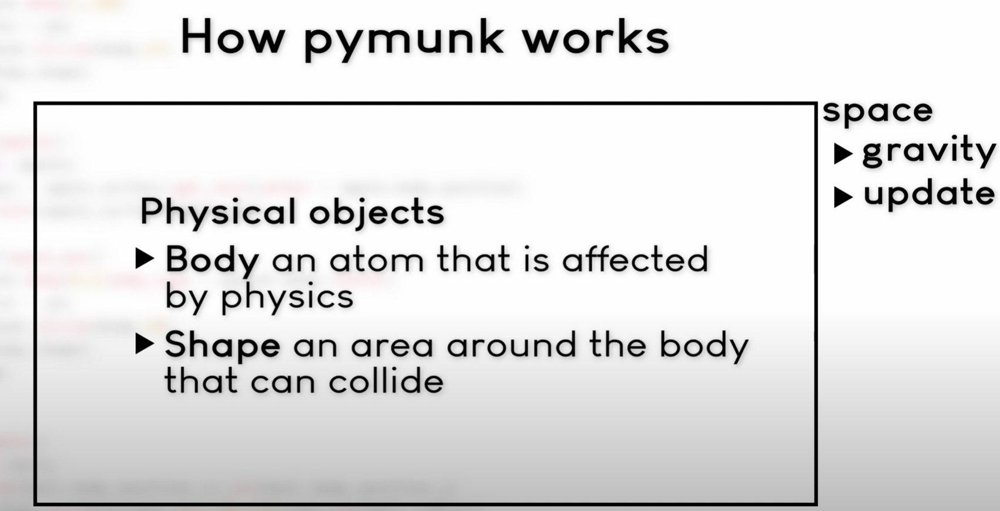

# pymunk

used with pygame for physics simulations
not really sure what im doing to do with this, but having some knowledge on it can be useful

pymunk - calculates the physics
pygame - displays the results

install with pip install pymunk

There are static bodies (static but can collide)
There are dynamic bodies (can move)
There are kinematic body (can be controlled by the player)

